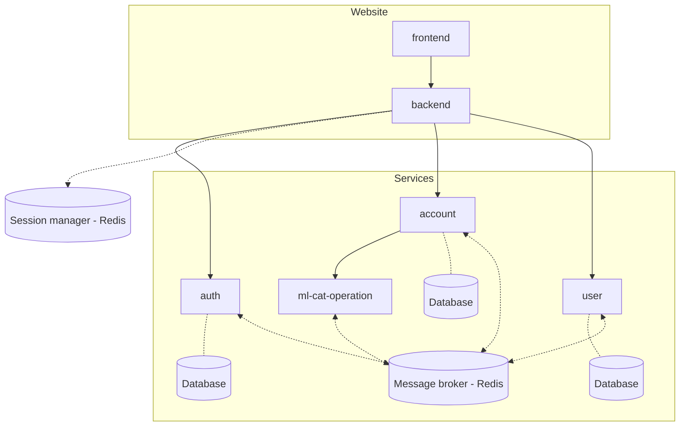

# Tirelire 💰

Tirelire is an app that enable users to follow their bank account activity and to classify their bank operations easily with machine learning models.

The app was first designed to help me to follow my account activity but it slowly ends up as a full featured app. I learned a lot about product design, software development, security and severals tools such as Redis.

## Getting Started 🚀

### Generate the private/public key 🔐
In order to sign the token for authorization and authentification, you need to generate a private and a public key.
The following command will help you to get those keys :
```sh
openssl ecparam -name prime256v1 -genkey -noout -out private-key.pem 
openssl ec -in private-key.pem -pubout -out public-key.pem 
```
You can share `public-key.pem` to all your services. `private-key.pem` should remains to `tirelire-auth` only.

### Run all the services with docker 🐳

Once the previous steps are done, you'll be able to run all the services with docker
```
docker-compose up
```

### Services
| services         | purpose                        | developed in  | status  |
|------------------|--------------------------------|---------------|---------|
| auth             | Generate Auth Token            | python 3.9.10 | 🏗️      |
| account          | Handle customer bank accounts  | python 3.9.10 | 🏗️      |
| user             | Handle user profile            | python 3.9.10 | 🏗️      |
| ml-cat-operation | Classifier for bank operations | python 3.9.10 | 🏗️      |
| web-backend      | Back-end for web UI            | python 3.9.10 | 🏗️      |
| web-frontend     | Front-end for web UI           | Vue3 + Vite   | 🏗️      |

### Testing suite

in order to be able to run all the test suite you must install `postgresql` and `redis-server`.

Then each python projet has a test suite that can be run with `poetry run test`. You can check the coverage with `poetry run report`.



## Features
### Create a new account


## Resources
Here is a list of the usefull resources that help me to design and develop this app.

- [Cosmic Python](https://www.cosmicpython.com/)
- [DDD, Hexagonal, Onion, CQRS, How I put it all together](https://herbertograca.com/2017/11/16/explicit-architecture-01-ddd-hexagonal-onion-clean-cqrs-how-i-put-it-all-together/)
